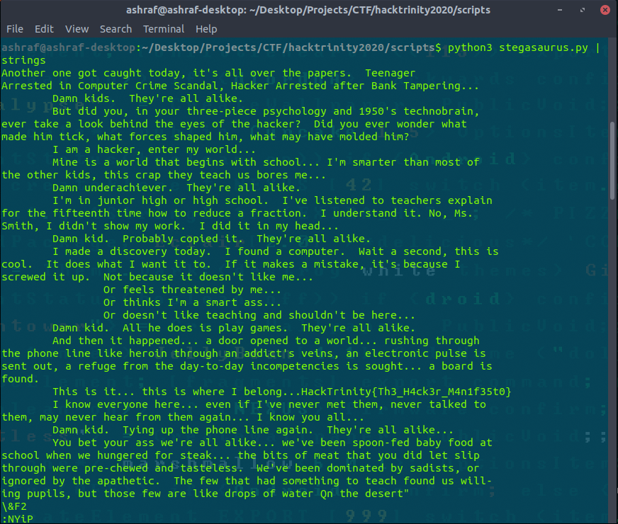
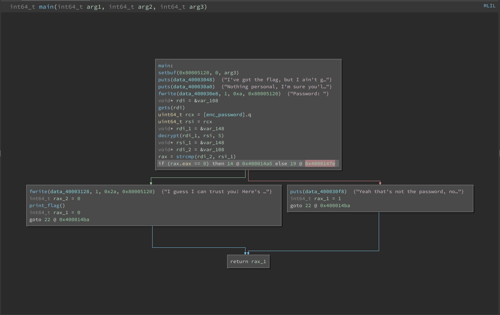
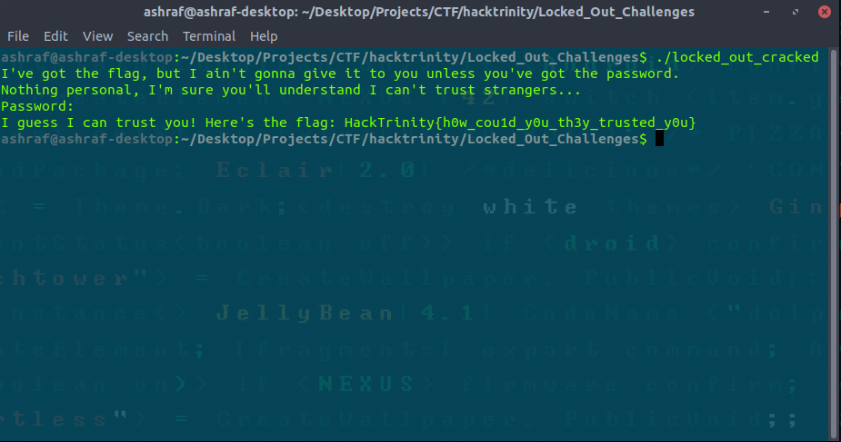
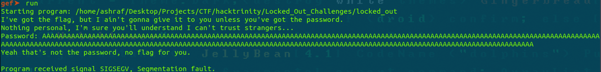
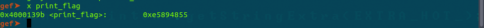
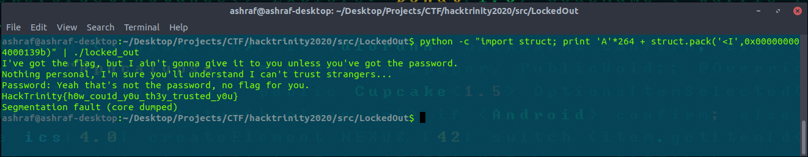
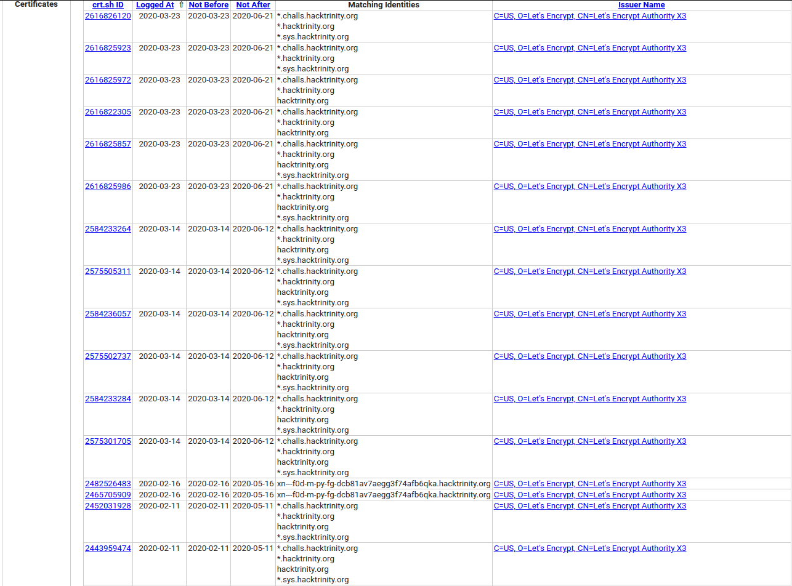
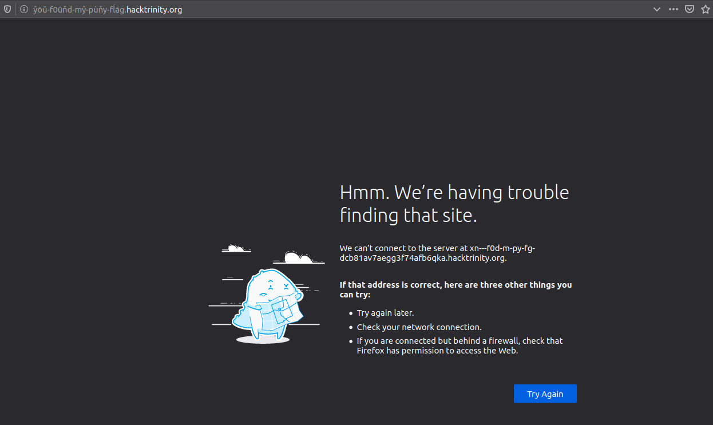

# HackTrinity 2020 Solutions

Write up's for HackTrinity 2020.
This is a bit brief but I'll add more as we go along.

I started preparing for this CTF around 3-4 days prior and this was my first CTF so it was certainly difficult.

There were quite a few helpful resources. Primarily [Conor Mac Amhlaoibh](https://github.com/conormccauley1999/HackTrinity19Writeups/blob/master/README.md)'s write up for last years HackTrinity which helped me get a good feel for competition.

## Solved Problems


### Stegosaurus
Topic(s) | Points | Difficulty (in my opinion)
---------|--------|-----------
`forensics` | `388` | 
#### Challenge:
    My friend Wu said this was a better stegosaurus picture. Personally I can't see any DIFFERENCE, from the Previous Visual Depictions. Can you?

#### Solution: 
This problem was really interesting and took me a while to figure out. 

The key was figuring out the few hints in the challenge description. Wu isn't some random person, he's the author of a paper on [Pixel Value Differencing](https://people.cs.nctu.edu.tw/~whtsai/Journal%20Paper%20PDFs/Wu_&_Tsai_PRL_2003.pdf).

A quick read of the paper specifies an algorithm to encode and decode these images but I wasn't arsed to implement it myself so I looked one up on github and found one with nearly the exact same challenge description by [zst-ctf](https://github.com/zst-ctf/tjctf-2019-writeups/blob/master/Writeups/Planning_Virtual_Distruction/README.md).

I quickly tried his python script only to find that it didn't work.
I read over the paper again and found another set of range widths [2, 2, 4, 4, 4,8, 8, 16, 16, 32, 32, 64, and 64] and adjusted the if statements to suit. [Adjusted Python Script](src/Stegosaurus/Stegosaurus.py)

Running the program outputted the following:

With the flag being: **HackTrinity{Th3_H4ck3r_M4n1f35t0}**

### Locked Out 1
Topic(s) | Points | Difficulty
---------|--------|-----------
`Reversing` | `288` | 

##### Challenge:
    So I found this program on a hacking forum. The OP attached it to the thread saying he'd found a way to share his flag and you can't read it without knowing the password. I have no idea what the password is, but there were a lot of others laughing at OP saying they got the flag. Can you get it for me?
[Link](src/LockedOut/locked_out)
#### Solution:
This challenge actually has 2 solutions and the only reason I'm giving it a medium is because I took so long to find the reversing one. The second solution is discussed in [Locked Out 2](#Locked-Out-2)

The solution is rather simple and I think it's best described by a [LiveOverflow Video](https://www.youtube.com/watch?v=LyNyf3UM9Yc)

But all we're doing is going into Binary Ninja and patching the if statement so that it always outputs the flag. Save it is locked_out_cracked, run it and there's the flag.
##### Binary Ninja

##### Flag

### Locked Out 2
Topic(s) | Points | Difficulty
---------|--------|-----------
`Exploitation` | `394` | 
#### Challenge:
    So back on the hacking forum, OP sick of being laughed at, said he's secured his flag by running his code on a remote server - he hasn't changed the code though.
#### Solution:
This challenge was a lot handier because I had already had the idea of abusing bufferoverflows to retrieve the flag for Locked Out 1.

The code was the exact same, except this locked out file was located on a server and when you connect to it, there's no room for commands. If you decompiled or ran gdb on the source code from locked out 1, you'll notice the use of gets to take input from the console. 

This could only be a buffer overflow attack. 

A handy video I had found from [John Hammond](https://www.youtube.com/watch?v=hB_oLDjhBIQ&t) explains his solution from a similar challenge from the picoCTF series.

Since we had the code we just needed to figure out how many 'A's I'd need to overflow the buffer. I basically brute forced this by getting a really high number and a low number and found the number of A's needed .
##### Overflow


Next I needed to find the location of the flag. I found a function called print_flag using gdb and then found its location.

##### print_flag location


After that I used python to prepare our overflow attack and execute the program

The struct module was handy because it converted our function location and transferred it instantly
```
python -c "import struct; print 'A'*264 + struct.pack('<I',0x000000004000139b)" | ./locked_out
```


Now that I verified it worked for my test, I was ready to do it remotely. 

Place the following into the terminal, and our flag is revealed

```
python -c "import struct; print 'A'*264 + struct.pack('<I',0x000000004000139b)" | nc 192.168.146.1 1337
```
Flag: **HackTrinity{bonfire_vet_TV_misplacement}**

### Badmin
Topic(s) | Points | Difficulty (in my opinion)
---------|--------|-----------
`web` | `350` | 
##### Challenge:
    There's a new sysadmin in town and he thinks he's real cool. Apparently he's been working hard on his new website...

    You can find the server at 192.168.140.1.
#### Solution:
This challenge was by no means hard, it's actually rediculously easy. But rest assured, I've spent more time on this one question than I have on some of my modules.

See when you follow the website you're met with a static page. I checked if there was anything being sent to and from a server, nothing. The website said it was built under [TodoMVC](http://todomvc.com/) so I quickly checked for any exploits and even found [the source code](http://todomvc.com/examples/react/#/) for the website. Still nothing.

The hint in the challenge is that he's a sysadmin. I ran an nmap scan, only port 80 was open. So I thought it must be something to do with directories. I checked /flag.txt, /flag.png and what not. I ran multiple different directory brute forces. Including [dirb](https://medium.com/tech-zoom/dirb-a-web-content-scanner-bc9cba624c86), [dirbuster](https://tools.kali.org/web-applications/dirbuster), [dirsearch](https://github.com/maurosoria/dirsearch) and [gobuster](https://github.com/OJ/gobuster). All for naught.

Finally, and depressingly I ran a [nikto](https://tools.kali.org/information-gathering/nikto). Nikto specified something along the lines of
```
The server install allows the reading of any system file by adding an extra '/' to the URL
```
So I tried 192.168.140.1//flag.txt and would you believe, the flag was just sitting there - mocking me.

Flag: **HackTrinity{representation_photograph_vote_reasoning}**

I don't even understand what the flag is supposed to mean. 

### Decode me
Topic(s) | Points | Difficulty
---------|--------|-----------
`Crypto` | `238` | 

##### Challenge:
    nby zfua zil nbcm wbuffyhay cm: RGVjb2RpbmdfY2FuX2JlX2Z1bl91bnRpbF95b3Vfc3RhcnRfbWl4aW5nX2l0X3Vw doqd! :)
#### Solution: 
This challenge had a few annoying red herrings. And took me longer than it should've to cop it.

See the first part, "nby zfua zil nbcm wbuffyhay cm:" is actually a rot 6 shift and translates to
```
the flag for this challenge is:
```
Basically useless.

So we go on to the next part "RGVjb2RpbmdfY2FuX2JlX2Z1bl91bnRpbF95b3Vfc3RhcnRfbWl4aW5nX2l0X3Vw"

Throwing that into [CyberChef](https://gchq.github.io/CyberChef/#recipe=Magic(3,false,false,'')&input=UkdWamIyUnBibWRmWTJGdVgySmxYMloxYmw5MWJuUnBiRjk1YjNWZmMzUmhjblJmYldsNGFXNW5YMmwwWDNWdw), it turns out that it's a base64 encoding and we get:
```
Decoding_can_be_fun_until_you_start_mixing_it_up
```
Wrap it and your flag is: **HackTrinity{Decoding_can_be_fun_until_you_start_mixing_it_up}**

I still don't know what *doqd!* is supposed to mean.
### Domain Names Suck
Topic(s) | Points | Difficulty
---------|--------|-----------
`Recon` | `379` | 
#### Challenge:
    Somebody pwned our DNS a while back and set up a website on a subdomain. They've since cleaned it out and we don't know what the website was called. We're all about transparency here at HackTrinity so we'd like to let our users know.

    Note: This flag will not be in the standard HackTrinity{} format
#### Solution:
This challenge required a particular attention to detail.

If you look up subdomain search it doesn't really help. There's a few tools that try and get all the subdomains that are currently active but this subdomain wasn't.

The challenge specifies we're all about *transparency*, where you had to notice that transparency was in italics.

If you look up subdomain trasparency a [medium article](https://medium.com/@ghostlulzhacks/certificate-transparency-logs-86dfb924c32f) comes up. Interestingly enough anytime you get a https:// for your domain it's logged in the certificate transparency logs.

The article also included a website to look up these logs called [crt.sh](https://crt.sh/?q=hacktrinity.org).

If you look up hacktrinity.org on crt.sh a few subdomains pop up.


The only one that looked out of the blue is: xn---f0d-m-py-fg-dcb81av7aegg3f74afb6qka .hacktrinity.org

Typing that into the browser and we get:


Copy the flag subdomain in and claim our points.
